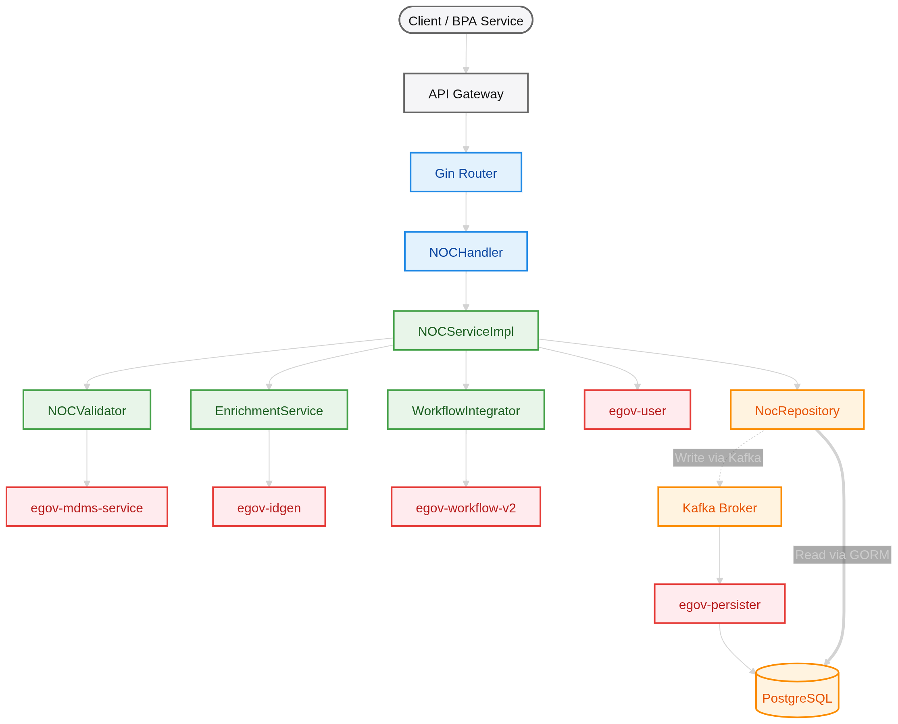
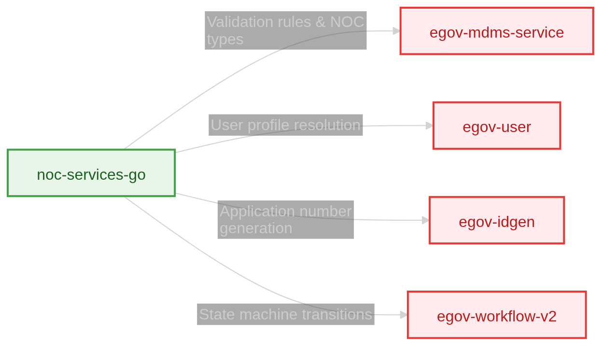
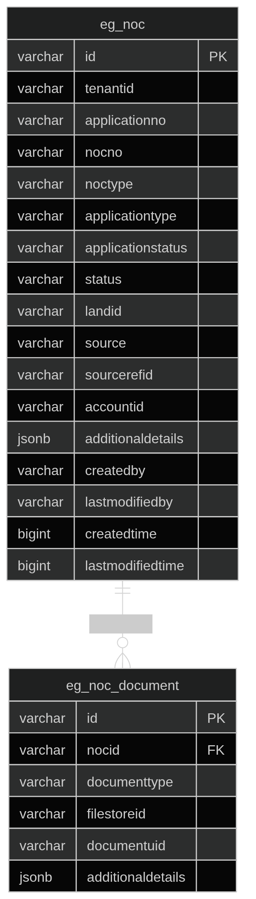

# NOC Services Go

> **DIGIT-OSS** · No Objection Certificate microservice rewritten in Go for high performance and minimal resource usage.


<!--  -->

---

## Table of Contents

- [Overview](#overview)
- [Architecture](#architecture)
- [Project Structure](#project-structure)
- [Getting Started](#getting-started)
- [Configuration](#configuration)
- [API Reference](#api-reference)
- [External Dependencies](#external-dependencies)
- [Database Schema](#database-schema)
- [Performance](#performance)
- [Contributing](#contributing)
- [License](#license)

---

## Overview

**noc-services-go** manages the lifecycle and approval workflows for **No Objection Certificates** (e.g., Fire NOC) required during the Building Plan Approval (BPA) process within the DIGIT municipal platform.

This service is a ground-up rewrite of the original Java Spring Boot microservice, delivering:

| Metric | Java (Spring Boot) | Go (Gin/GORM) | Improvement |
|---|---|---|---|
| Idle Memory | ~450 MB | ~18 MB | **25×** smaller |
| Cold Start | 15–25 s | ~45 ms | **~400×** faster |
| Docker Image | ~280 MB | ~24 MB | **11×** smaller |

### Key Design Principles

- **Explicit Wiring** — All dependencies are manually injected in `main.go`; no reflection or runtime magic.
- **Interface-Driven** — Business services and repositories are bound to Go interfaces for testability.
- **CQRS** — Writes are asynchronous via Kafka; reads are synchronous via GORM against PostgreSQL.

---

## Architecture



### Request Flows

| Operation | Endpoint | Flow |
|---|---|---|
| **Create** | `POST /_create` | Handler → Validate (MDMS) → Enrich (IDGen) → Workflow (INITIATE) → Kafka |
| **Update** | `POST /_update` | Handler → Validate → Workflow (FORWARD/APPROVE/REJECT) → Kafka |
| **Search** | `POST /_search` | Handler → Service → GORM query → PostgreSQL |

---

## Project Structure

```
noc-services-go/
├── cmd/noc-services/          # Application entrypoint (main.go)
├── configs/
│   └── app.yaml               # Service configuration (Viper)
├── deployments/
│   └── Dockerfile             # Multi-stage Docker build
├── internal/
│   ├── config/                # Configuration loader
│   ├── domain/                # Domain models, interfaces, DTOs
│   ├── repository/
│   │   ├── models/            # GORM models (NocModel, NocDocumentModel)
│   │   └── postgres/          # Repository implementation (CQRS)
│   ├── service/               # Business logic & enrichment
│   │   └── notification/      # SMS notification service
│   ├── transport/
│   │   ├── http/              # Gin router & handlers
│   │   └── kafka/             # Kafka producer
│   ├── util/                  # Error types, helpers
│   ├── validator/             # Domain validation rules
│   └── workflow/              # Workflow engine integration
├── go.mod
└── go.sum
```

---

## Getting Started

### Prerequisites

| Dependency | Version |
|---|---|
| Go | ≥ 1.21 |
| PostgreSQL | 12+ |
| Apache Kafka | 2.x+ |
| DIGIT platform services | `egov-mdms`, `egov-idgen`, `egov-user`, `egov-workflow-v2`, `egov-persister` |

### Quick Start

```bash
# Clone the repository
git clone <repo-url> && cd noc-services-go

# Install dependencies
go mod download

# Configure environment (or edit configs/app.yaml)
export DB_HOST=localhost DB_PORT=5432 DB_NAME=rainmaker_new
export DB_USER=postgres DB_PASSWORD=postgres
export KAFKA_BROKERS=localhost:9092

# Run the service
go run ./cmd/noc-services

# Verify health
curl -s http://localhost:8100/noc-services/health
# → {"status":"UP"}
```

### Docker

```bash
# Build the image
docker build -f deployments/Dockerfile -t noc-services-go .

# Run the container
docker run -p 8100:8100 \
  -e DB_HOST=host.docker.internal \
  -e KAFKA_BROKERS=host.docker.internal:9092 \
  noc-services-go
```

---

## Configuration

Configuration is managed via [Viper](https://github.com/spf13/viper) and loaded from [`configs/app.yaml`](configs/app.yaml). All values can be overridden with environment variables.

| Category | Key Config Keys | Default |
|---|---|---|
| **Server** | `server.port`, `server.context` | `8100`, `/noc-services` |
| **Database** | `db.host`, `db.port`, `db.name`, `db.user`, `db.password` | `localhost:5432` |
| **Kafka** | `kafka.brokers` | `localhost:9092` |
| **ID Generation** | `idgen.host`, `idgen.path` | `localhost:8088` |
| **Workflow** | `workflow.host` | `localhost:8280` |
| **MDMS** | `mdms.host`, `mdms.endpoint` | `localhost:8094` |
| **Pagination** | `pagination.defaultLimit`, `pagination.maxLimit` | `10`, `1000` |

---

## API Reference

All endpoints are prefixed with `/noc-services`.

### `POST /noc-services/v1/noc/_create`

Create a new NOC application. Triggers ID generation, MDMS validation, and workflow initiation.

<details>
<summary>Request body</summary>

```json
{
  "RequestInfo": { "authToken": "..." },
  "Noc": {
    "tenantId": "pb.amritsar",
    "nocType": "FIRE_NOC",
    "source": "BPA",
    "sourceRefId": "<bpa-application-id>",
    "applicationType": "NEW"
  }
}
```
</details>

### `POST /noc-services/v1/noc/_update`

Update an existing NOC application. Supports workflow transitions: `FORWARD`, `APPROVE`, `REJECT`.

<details>
<summary>Request body</summary>

```json
{
  "RequestInfo": { "authToken": "..." },
  "Noc": {
    "id": "<noc-uuid>",
    "tenantId": "pb.amritsar",
    "applicationNo": "PB-NOC-2026-000001",
    "workflow": {
      "action": "FORWARD",
      "comments": "Forwarding for approval"
    }
  }
}
```
</details>

### `POST /noc-services/v1/noc/_search`

Search NOC applications by criteria.

| Query Parameter | Type | Description |
|---|---|---|
| `tenantId` | `string` | **Required.** Tenant identifier |
| `ids` | `string[]` | Filter by NOC UUIDs |
| `applicationNo` | `string` | Filter by application number |
| `nocType` | `string` | Filter by NOC type |
| `applicationStatus` | `string` | Filter by workflow status |
| `source` | `string` | Filter by source module |
| `sourceRefId` | `string` | Filter by source reference ID |
| `offset` | `int` | Pagination offset (default: `0`) |
| `limit` | `int` | Page size (default: `10`, max: `1000`) |

---

## External Dependencies

The service integrates with the following DIGIT platform microservices via synchronous REST calls:



| Service | Purpose | When Called |
|---|---|---|
| `egov-mdms-service` | Fetch NOC type rules, document mappings, validation constraints | Create, Update |
| `egov-user` | Resolve citizen/employee identity profiles | Create |
| `egov-idgen` | Generate unique application and certificate numbers | Create (enrichment) |
| `egov-workflow-v2` | Manage state transitions (`INITIATE` → `FORWARD` → `APPROVE`) | Create, Update |
| `egov-persister` | Consume Kafka events and persist to PostgreSQL | Async (Kafka consumer) |

---

## Database Schema

The service reads from the following tables in the `rainmaker_new` PostgreSQL database. Writes are handled asynchronously by `egov-persister` via Kafka.



### Kafka Topics

| Topic | Trigger | Consumer |
|---|---|---|
| `save-noc-application` | Create NOC | `egov-persister` |
| `update-noc-application` | Update NOC (full record) | `egov-persister` |
| `update-noc-workflow` | Update NOC (workflow only) | `egov-persister` |
| `egov.core.notification.sms` | Send SMS notification | `egov-notification-sms` |

---

## Performance

Benchmarked against the legacy Java Spring Boot service in identical Kubernetes environments:

| Metric | Java | Go | Factor |
|---|---|---|---|
| Idle Memory | ~450 MB | **18 MB** | 25× reduction |
| Under-Load Memory | ~1.2 GB | **65 MB** | 18× reduction |
| Cold Start | 15–25 s | **45 ms** | ~400× faster |
| Docker Image | ~280 MB | **24 MB** | 11× smaller |
| Concurrency | Thread-pool | Goroutines (CSP) | Orders of magnitude |

---

## Error Handling

The service produces DIGIT-compatible error responses, maintaining parity with Spring Boot's `@ControllerAdvice` pattern:

```json
{
  "Errors": [
    {
      "code": "INVALID_NOC_TYPE",
      "message": "NOC type 'UNKNOWN' is not in the MDMS master list"
    }
  ]
}
```

| Error Type | HTTP Status | Usage |
|---|---|---|
| `util.CustomError` | `400` | Business rule violations |
| `util.MultiError` | `400` | Multiple field validation failures |
| Internal errors | `500` | Unexpected service failures |
